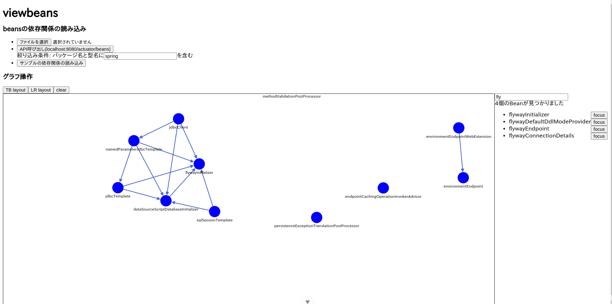

# viewbeans

##  about


viewbeans is web application to visualize SpringBoot application beans dependencies from SpringBoot actuator API response




## usage

### setup

```shell
npm install
```

### run

```shell
npm run dev
```

## format

- vue file

```
npx prettier ./**/*.vue --write
```

- other file

```
npx @biomejs/biome format --write .
```

## reference

- SpringBoot actuator /beans API resopnse structures are shown below link.

https://spring.pleiades.io/spring-boot/api/rest/actuator/beans.html
